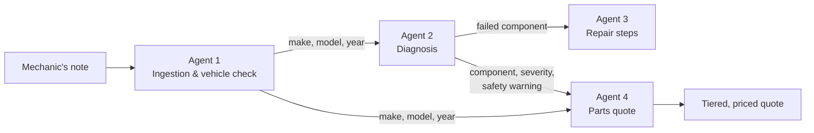
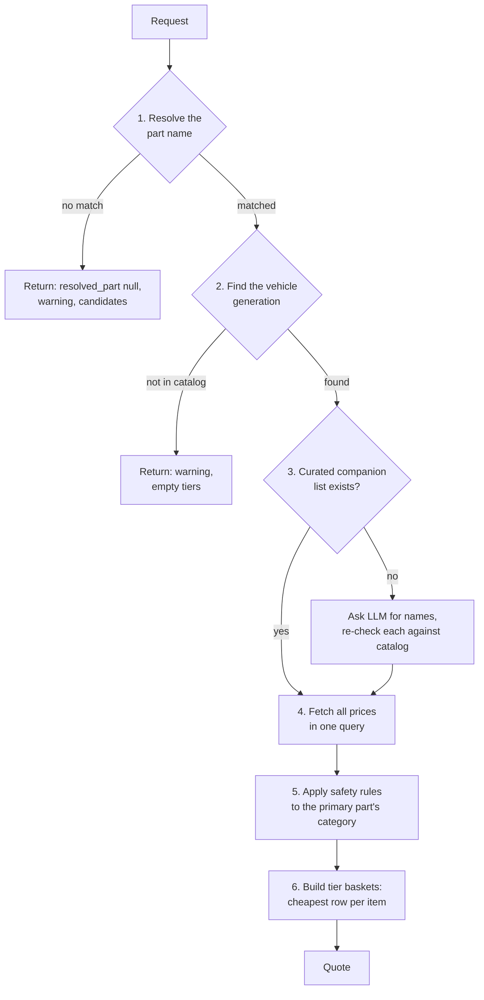

# Agent 4 — Procurement & Pricing: start-to-finish guide

Agent 4 answers one question: **"This part failed on this car — what do I need to
buy, and what will it cost?"**

It takes the failed component that Agent 2 diagnosed, works out which catalog part
that is, adds the companion parts the job needs, and returns a priced quote in up to
three quality tiers. Every price and part number comes from a MongoDB catalog.

> **The one rule:** the LLM may propose part *names*; only the database may supply
> *prices and part numbers*.

This guide walks through the whole thing in order. For design history, every
limitation and troubleshooting, see the reference document [AGENT4.md](AGENT4.md)
(its file paths predate the move into `backend/agents/`).

---

## Contents

1. [Where Agent 4 sits](#1-where-agent-4-sits)
2. [Technologies](#2-technologies)
3. [Input](#3-input)
4. [Output](#4-output)
5. [The workflow, step by step](#5-the-workflow-step-by-step)
6. [How a part name is resolved](#6-how-a-part-name-is-resolved)
7. [Confidence: what the numbers mean and how good they are](#7-confidence-what-the-numbers-mean-and-how-good-they-are)
8. [Code flow](#8-code-flow)
9. [The data](#9-the-data)
10. [Two worked examples](#10-two-worked-examples)
11. [Running and testing it](#11-running-and-testing-it)
12. [What it does not do](#12-what-it-does-not-do)

---

## 1. Where Agent 4 sits



Agent 4 needs two things that come from two different agents:

- **The vehicle** (make, model, year) from Agent 1.
- **The failed component** (plus severity and safety warning) from Agent 2.

Agent 2's output carries no vehicle, and parts are priced per vehicle generation, so
a component name alone cannot be priced. The frontend (`App.jsx`) holds both results
and combines them into one request. There is no backend orchestrator.

---

## 2. Technologies

| Technology | Used for |
|---|---|
| **Python 3** | All Agent 4 code |
| **FastAPI** + **uvicorn** | The HTTP endpoint `POST /api/v1/procure` |
| **Pydantic** | Request and response validation (`core/models.py`) |
| **MongoDB** via **pymongo** | The parts catalog: prices, part numbers, aliases, companion parts, safety rules |
| **rank-bm25** (`BM25Okapi`) | Matching a part description to a catalog name by word overlap |
| **RapidFuzz** | Matching misspelt part names by character similarity |
| **Groq API** (model `openai/gpt-oss-120b`) | Proposing companion part *names*, only when the catalog has no curated list |
| **python-dotenv** | Reading `MONGO_URI`, `MONGO_DB`, `GROQ_API_KEY`, `GROQ_MODEL` from `backend/.env` |
| **React** + **Vite** | The "Agent 4 // Parts Quote" panel in the frontend |
| **pytest** | 42 automated tests |

No vector database and no embeddings are used. Part matching is entirely lexical
(exact lookup, BM25, fuzzy).

---

## 3. Input

`POST /api/v1/procure` — model `ProcurementRequest` in
[core/models.py](../backend/core/models.py).

```json
{
  "session_id": "sess_abc123",
  "root_cause_component": "Brake Pads",
  "make": "Toyota",
  "model": "Corolla",
  "year": 2020,
  "severity": "High",
  "safety_warning": "Support the vehicle on axle stands."
}
```

| Field | Required | Notes |
|---|---|---|
| `session_id` | yes | For tracking only |
| `root_cause_component` | yes | Free text. May be a clean name (`Brake Pads`), slang (`dynamo`), a typo (`raditor`) or a short phrase (`shockers gone`) |
| `make`, `model` | yes | Must match the catalog spelling |
| `year` | yes | **Must be an integer.** A string year makes the generation lookup return nothing, silently |
| `severity` | no | Defaults to `"Medium"`. Passed through unchanged |
| `safety_warning` | no | Defaults to `""`. Passed through unchanged |

Agent 2's `failure_mode` text is deliberately **not** sent: symptom prose adds
non-part words that degrade the match.

---

## 4. Output

Model `ProcurementResponse` in [core/models.py](../backend/core/models.py).

| Field | Meaning |
|---|---|
| `resolved_part` | The catalog part the input was matched to, or `null` if nothing matched |
| `match_method` | Which stage matched: `exact`, `alias_exact`, `alias_partial`, `bm25`, `fuzzy` or `none` |
| `match_confidence` | 0.0–1.0. See [section 7](#7-confidence-what-the-numbers-mean-and-how-good-they-are) |
| `bill_of_materials` | The primary part plus its companion parts |
| `unpriced_items` | Companion names the LLM proposed that the catalog could not confirm. Never priced |
| `tiers` | One basket per quality tier that survived the safety rules |
| `suppressed_tiers` | Tiers withheld by a safety rule |
| `severity`, `safety_warning` | Passed through from the request |
| `warnings` | Plain-language notes on anything that affected the quote |
| `candidates` | Closest catalog names, when nothing matched |

Each tier (`OEM_Genuine`, `Certified_Aftermarket`, `Economy`) holds:

| Field | Meaning |
|---|---|
| `tier_total_lkr` | Sum of the cheapest row per item at this tier |
| `complete` | `false` if any item has no row at this tier, so the total is not the full job |
| `parts[]` | Line items: `part_name`, `brand`, `part_number`, `price_lkr`, `price_updated`, `currency`, `supplier`, `role` (`primary`, `required` or `recommended`) |

Two fields look similar and mean different things:

- `complete: false` — the catalog has **no row** for some item at that tier.
- `suppressed_tiers` — the tier was **deliberately withheld** for safety.

### Status codes

| Situation | Status |
|---|---|
| Normal quote | `200` |
| Unknown part, unlisted vehicle, part not stocked | `200` with a warning (these are normal results, not errors) |
| Malformed request | `422` |
| Agent 4 failed to import | `503` |
| Groq API error that escaped the built-in fallback | `502` |
| MongoDB down or any other fault | `500` |

---

## 5. The workflow, step by step

Everything happens inside `get_procurement_quote()` in
[agent4_procurement.py:187](../backend/agents/agent4_procurement/agent4_procurement.py).



**Step 1 — Resolve the part name.** The free-text component is mapped to one of the
70 catalog part names ([section 6](#6-how-a-part-name-is-resolved)). If nothing
matches, the function returns immediately with candidates and prices nothing.

**Step 2 — Find the vehicle generation.** Prices are stored per generation (a 2013
Corolla and a 2020 Corolla take different parts). The `generations` collection is
queried for `year_from <= year <= year_to`. If the year falls in two generations, the
newer one is quoted and a warning recommends confirming by VIN.

**Step 3 — Build the bill of materials.** The `bom_dependencies` collection is looked
up for the primary part.

- **Found:** its `requires` and `recommends` lists are used. The LLM is not called.
- **Not found:** the LLM is asked for companion part *names* only (temperature 0,
  prompt forbids prices, brands and part numbers). Each name is re-resolved against
  the catalog in strict mode and must reach confidence 0.7. Names that fail go to
  `unpriced_items`. If the LLM is unreachable, the quote continues with the primary
  part only and a warning.

At most 3 items per list, enforced in code.

**Step 4 — Fetch every price.** One indexed query on `parts` for that make, model,
generation and all the part names. It returns every tier for every item.

**Step 5 — Apply safety rules.** The `safety_rules` collection is looked up by the
**primary** part's category. Blocked tiers are removed and listed in
`suppressed_tiers` with the reason in `warnings`. Example: Economy is withheld for
braking parts.

**Step 6 — Build the tier baskets.** For each remaining tier, the cheapest row per
item is taken and summed. A basket can mix brands; it is a price floor, not a
purchase order.

**Cost of a typical request:** three MongoDB round trips plus a small safety-rule
lookup, and no LLM call when the part has a curated companion list.

---

## 6. How a part name is resolved

`PartResolver.resolve()` in
[agent4_resolver.py:357](../backend/agents/agent4_procurement/agent4_resolver.py)
tries stages in order and stops at the first one that accepts.

| # | Stage | What it catches | Example |
|---|---|---|---|
| 1 | **Exact** | The whole string is a catalog name or a known trade term | `Brake Pads`, `dynamo` → Alternator |
| 2 | **Alias n-gram** | A known term inside a longer phrase | `shockers gone` → Shock Absorber |
| 3 | **BM25** | The right words in any order, or most of them | `sensor mass air` → Mass Air Flow Sensor |
| 4 | **Fuzzy, whole string** | A misspelt name on its own | `Altenator` → Alternator |
| 5 | **Fuzzy, word by word** | A misspelt word inside a phrase | `raditor leaking` → Radiator |
| — | **No match** | Anything else | `flux capacitor` → `null` plus candidates |

Three behaviours are worth knowing:

- **Dismissed parts are skipped.** `not the alternator, battery is dead` resolves to
  Battery. `pads are fine but rotor is warped` resolves to Brake Disc.
  `replaced the alternator already` resolves to nothing. But `dynamo not charging`
  still resolves to Alternator, because there `not` describes the symptom.
- **A longer name beats the shorter name inside it.** `gasket for the water pump`
  resolves to Water Pump Gasket, not Water Pump.
- **Ties are refused.** `pads and rotor both worn` names two parts equally, so it
  returns no match with both as candidates.

**Strict mode** (`allow_partial=False`) is used only for names proposed by the LLM. It
turns off stages 2 and 5 and requires every word of the proposal to belong to the
matched part, so a vague proposal such as `maybe a horn` is never priced.

---

## 7. Confidence: what the numbers mean and how good they are

### What `match_confidence` means per method

| `match_method` | Confidence | How to read it |
|---|---|---|
| `exact`, `alias_exact` | 1.0 | The input is literally a catalog name or curated alias. Fully reliable |
| `alias_partial` | 0.9 (fixed) | A curated term was found inside a longer phrase. Reliable, but the surrounding words are not understood |
| `bm25` | 0.60–1.0 | Coverage × agreement. Coverage is how much of the part's name or alias the query supplies. Agreement is how much of the query's part vocabulary that part owns |
| `fuzzy` (whole string) | 0.80–1.0 | Character similarity ÷ 100 |
| `fuzzy` (word by word) | 0.60–1.0 | The BM25 score **after** spelling correction |
| `none` | 0.0 | Nothing matched |

Acceptance thresholds, defined at the top of `agent4_resolver.py` and
`agent4_procurement.py`:

| Constant | Value | Meaning |
|---|---|---|
| `BM25_ACCEPT` | 0.60 | Minimum BM25 confidence |
| `BM25_MARGIN` | 0.10 | The best part must beat the runner-up by this much |
| `FUZZY_ACCEPT` | 80 | Minimum similarity (0–100) for fuzzy matches and for correcting a single word |
| `ALIAS_PARTIAL_CONFIDENCE` | 0.9 | Fixed confidence for an embedded alias |
| `LLM_RESOLVE_ACCEPT` | 0.7 | Minimum confidence before an LLM-proposed companion may be priced |

**Caveats on reading the number:**

- It is a match score, not a calibrated probability. 0.9 does not mean "90% likely
  correct".
- A corrected typo can report 1.0, because the score is computed after correction.
  The `fuzzy` method label is the only sign a correction happened.
- The confidence covers the **part name match only**. It says nothing about whether
  Agent 2's diagnosis was right, or whether the vehicle generation is right.

### How good it is, measured

`eval/run_eval.py` runs `resolve()` over a test set and counts each query as
**correct**, **wrong** (a different part was accepted) or **unresolved**.

**Held-out set** — 86 hand-written queries in
[testset_heldout.csv](../eval/testset_heldout.csv):

| Category | Queries | Correct | Wrong | Unresolved |
|---|---:|---:|---:|---:|
| Typos | 23 | 21 | 0 | 2 |
| Reordered words | 12 | 12 | 0 | 0 |
| Unseen trade terms | 23 | 7 | 0 | 16 |
| Negation / already done | 11 | 10 | 0 | 1 |
| Full sentences | 3 | 3 | 0 | 0 |
| Not a catalog part (should stay unresolved) | 14 | 14 | 0 | 0 |
| **All** | **86** | **67** | **0** | **19** |

Reading this:

- **It does not guess.** No query was matched to the wrong part, and all 14 non-parts
  were correctly refused.
- **It is strong on typos and word order.**
- **It is weak on vocabulary it has never seen.** `trunk lid` or `accumulator` return
  no match, because all matching is lexical. The fix is adding aliases.

**Alias-coverage set** — 40 queries in [testset.csv](../eval/testset.csv): 40/40.
Every query in it contains a term already in the alias table, so this is a regression
check, not a measure of quality.

**How far to trust these numbers:** the held-out queries were written by one person
who had read the alias table, and the 0.60 threshold was chosen without a sweep. They
are a fair before/after comparison (the same set scored 41 correct and 2 wrong before
the resolver rework), not an independent benchmark.

---

## 8. Code flow

### Files

| File | Role |
|---|---|
| [backend/main.py](../backend/main.py) | The route `POST /api/v1/procure` (line 336), handler `run_procurement()` |
| [backend/core/models.py](../backend/core/models.py) | `ProcurementRequest`, `QuotedPart`, `TierQuote`, `ProcurementResponse` |
| [backend/core/db.py](../backend/core/db.py) | MongoDB connection, `get_db()` |
| [agent4_procurement.py](../backend/agents/agent4_procurement/agent4_procurement.py) | The six-step workflow and the only LLM call |
| [agent4_resolver.py](../backend/agents/agent4_procurement/agent4_resolver.py) | `PartResolver`: part-name matching. Knows nothing about prices or vehicles |
| [data/generate_tables.py](../backend/agents/agent4_procurement/data/generate_tables.py) | Generates the five catalog CSVs. The source of truth for the data |
| [seed_agent4.py](../backend/agents/agent4_procurement/seed_agent4.py) | Loads the CSVs into MongoDB. Drops the collections first |
| [test_agent4_resolver.py](../backend/agents/agent4_procurement/test_agent4_resolver.py), [test_agent4_procurement.py](../backend/agents/agent4_procurement/test_agent4_procurement.py) | The 42 tests |
| [frontend/src/App.jsx](../frontend/src/App.jsx) | Calls the endpoint and renders the quote panel |
| [eval/run_eval.py](../eval/run_eval.py) | Evaluation harness |

All Agent 4 files except `main.py`, `core/` and `eval/` live in
`backend/agents/agent4_procurement/`.

### Call sequence for one request

```
App.jsx  handleRunTriage()
  │  POST /api/v1/ingest      → Agent 1: vehicle
  │  POST /api/v1/diagnose    → Agent 2: root_cause_component, severity, safety_warning
  │  POST /api/v1/repair      → Agent 3
  └─ POST /api/v1/procure     → Agent 4
        │
        main.py  run_procurement(request)
        └─ agent4_procurement.get_procurement_quote(...)
              │
              ├─ 1. get_resolver().resolve(root_cause_component)
              │       agent4_resolver.PartResolver.resolve()
              │         ├─ exact lookup          (aliases, catalog names)
              │         ├─ _alias_ngram()        → uses _ruled_out()
              │         ├─ _bm25_ranked()        → _clear_winner()
              │         ├─ whole-string fuzzy    (rapidfuzz)
              │         ├─ _correct_spelling()   → _bm25_ranked() again
              │         └─ _candidates()         on failure
              │
              ├─ 2. db.generations.find(...)             vehicle generation
              │
              ├─ 3. _build_bom(...)
              │       ├─ db.bom_dependencies.find_one()  curated list → return
              │       └─ _propose_bom_via_llm()          only if not curated
              │            └─ resolve(name, allow_partial=False) for each proposal
              │
              ├─ 4. db.parts.find(...)                   every price, one query
              ├─ 5. db.safety_rules.find_one(...)        withheld tiers
              └─ 6. cheapest row per item per tier       → response dict
```

The resolver is built once per process, on first use (`get_resolver()`), because
building the BM25 index on every request would dominate the cost.

`agent4_resolver.py` never imports `agent4_procurement.py`. That one-way dependency
is what lets the resolver be tested and evaluated without any pricing context.

---

## 9. The data

Five MongoDB collections. All figures are from the live database.

| Collection | Rows | Holds |
|---|---:|---|
| `parts` | 34,982 | One row per part × vehicle generation × tier × brand: price, part number, category |
| `generations` | 184 | Which model years belong to which generation code |
| `part_aliases` | 273 | Trade terms → catalog name (`dynamo` → Alternator) |
| `bom_dependencies` | 35 | Curated companion parts: `requires` and `recommends` |
| `safety_rules` | 14 | Which tiers are withheld for which part category |

Coverage: 70 part names, 169 make/model pairs, 32 makes, 3 tiers.

The CSVs in `backend/agents/agent4_procurement/data/` are **generated** by
`generate_tables.py`. Edit the Python lists in that file, regenerate, then re-seed.
Hand edits to a CSV are lost on the next regeneration.

All prices are synthetic (scaled by vehicle segment), not surveyed market prices.

---

## 10. Two worked examples

Both were run against the live catalog. Neither needed an LLM call.

### A clean name with a safety rule

**Input:** `Brake Pads`, 2020 Toyota Corolla, severity High.

- Resolved to **Brake Pads** — `exact`, confidence 1.0.
- Companion parts from the curated list: Brake Hardware Clips (required), Brake Fluid
  DOT4 and Brake Disc (recommended).
- **Economy withheld**: "Reconditioned braking components cannot be
  quality-verified; workshop liability risk."

| Part | OEM Genuine (LKR) | Certified Aftermarket (LKR) |
|---|---:|---:|
| Brake Pads | 14,900 | 8,300 |
| Brake Hardware Clips | 2,650 | 1,500 |
| Brake Fluid DOT4 | 3,500 | 1,950 |
| Brake Disc | 23,000 | 12,900 |
| **Tier total** | **44,050** | **24,650** |

### A misspelt name with a symptom

**Input:** `raditor leaking`, 2019 Honda Civic, severity Medium.

- Resolved to **Radiator** — `fuzzy` (word-by-word correction), confidence 1.0.
- Companion parts: Engine Coolant 4L and Radiator Hose (required), Thermostat
  (recommended).
- No tiers withheld, no warnings.

| Part | OEM Genuine (LKR) | Certified Aftermarket (LKR) | Economy (LKR) |
|---|---:|---:|---:|
| Radiator | 49,500 | 27,500 | 14,800 |
| Engine Coolant 4L | 5,500 | 3,050 | 1,650 |
| Radiator Hose | 6,800 | 3,800 | 2,050 |
| Thermostat | 11,000 | 6,200 | 3,300 |
| **Tier total** | **72,800** | **40,550** | **21,800** |

---

## 11. Running and testing it

Requires `backend/.env` with `MONGO_URI`, `MONGO_DB`, and (for the LLM fallback only)
`GROQ_API_KEY` and `GROQ_MODEL`.

Run these from the `backend/` folder with the repo-root `.venv` active.

Install dependencies:

```bash
pip install -r requirements.txt
```

Install the spaCy model that Agent 1 needs (without it `/api/v1/ingest` fails before
Agent 4 is ever reached):

```bash
python -m spacy download en_core_web_sm
```

Start the API:

```bash
uvicorn main:app --port 8000
```

### Tests and evaluation

The tests and the eval harness still import `db` and `agent4_resolver` as top-level
modules, which is where they lived before the move into `backend/agents/` and
`backend/core/`. Until those imports are updated, both need `PYTHONPATH` set. The
separator is `;` on Windows and `:` on macOS/Linux.

Run the tests from `backend/` (expect 42 passed). In PowerShell:

```powershell
$env:PYTHONPATH = ".;core;agents/agent4_procurement"; python -m pytest agents/agent4_procurement
```

In Git Bash:

```bash
PYTHONPATH=".;core;agents/agent4_procurement" python -m pytest agents/agent4_procurement
```

Run the evaluation from the repo root. In PowerShell:

```powershell
$env:PYTHONPATH = "backend/core;backend/agents/agent4_procurement"; python eval/run_eval.py
```

In Git Bash:

```bash
PYTHONPATH="backend/core;backend/agents/agent4_procurement" python eval/run_eval.py
```

Add `--testset eval/testset.csv` to score the alias-coverage set instead.

### Re-seeding the catalog

`seed_agent4.py` reloads the catalog. It **drops all five collections** in whatever
database `MONGO_DB` points at, so check that first if the database is shared.

---

## 12. What it does not do

- **It is a parts quote, not a job quote.** No labour, shop rate or tax.
- **Prices are synthetic** and have no live stock or exchange-rate data.
- **Fitment stops at the generation.** No trim, engine variant or drivetrain.
- **It only knows 169 make/model pairs.** Any other vehicle returns a warning and no
  prices.
- **It cannot match trade terms it has never seen.** They return no match rather than
  a guess.
- **Half the catalog has no curated companion list.** 35 of 70 parts fall back to the
  LLM for companion names (figure from [AGENT4.md](AGENT4.md), not re-counted).
- **Negation handling is rule-based.** Phrasing outside its rules is not understood.

The full list, with reasons and a prioritised backlog, is in
[AGENT4.md](AGENT4.md#limitations).
